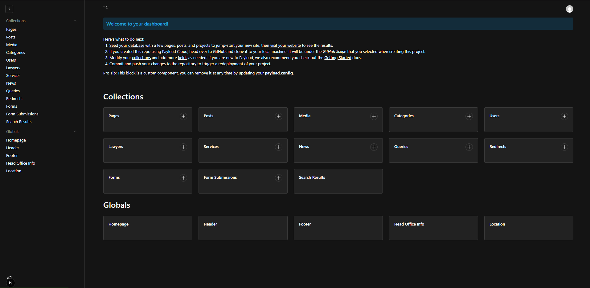
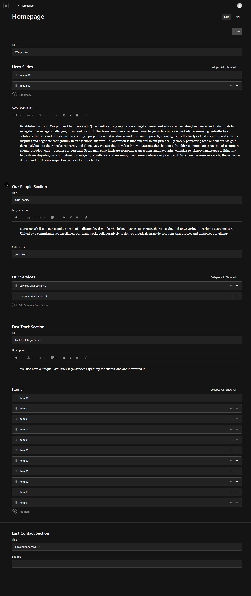
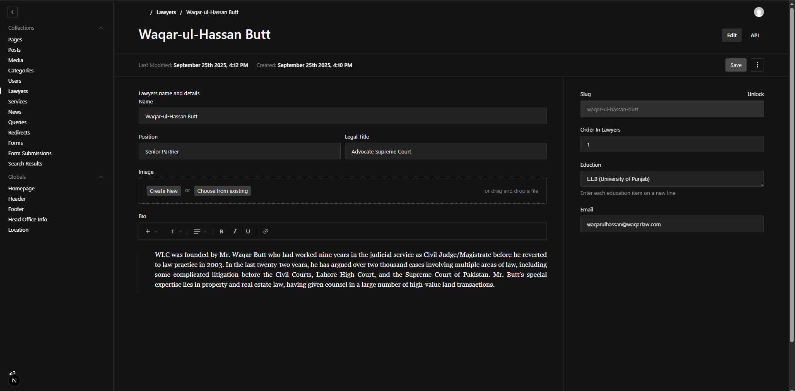
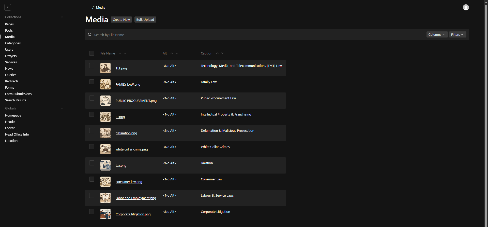
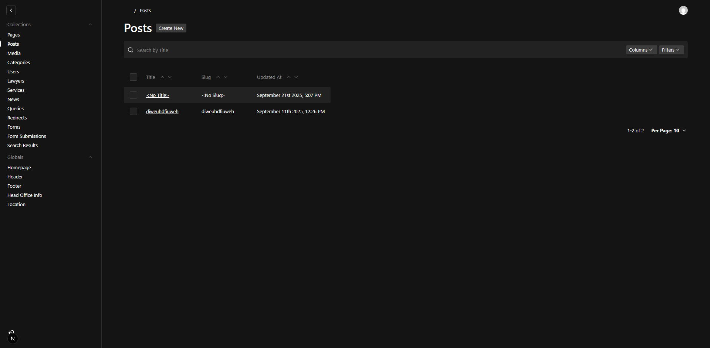
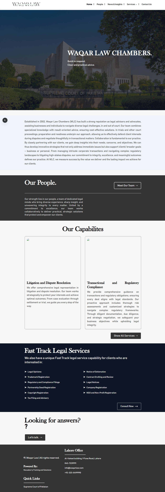
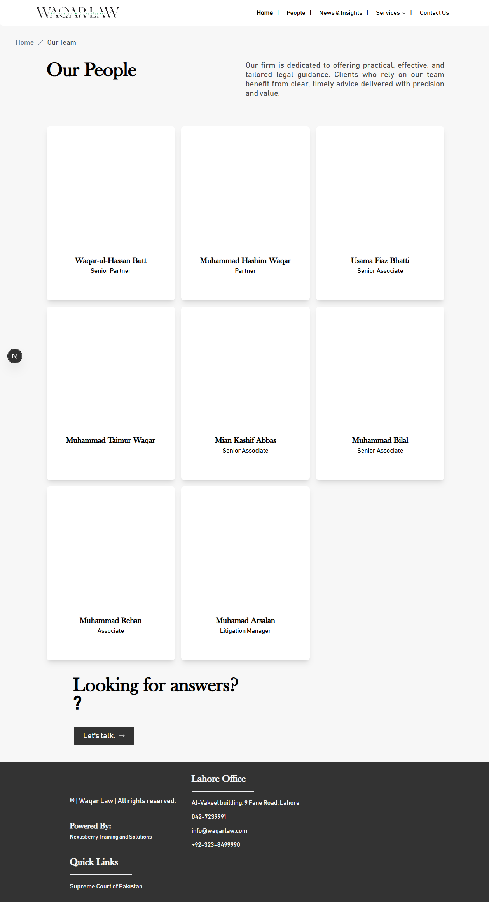
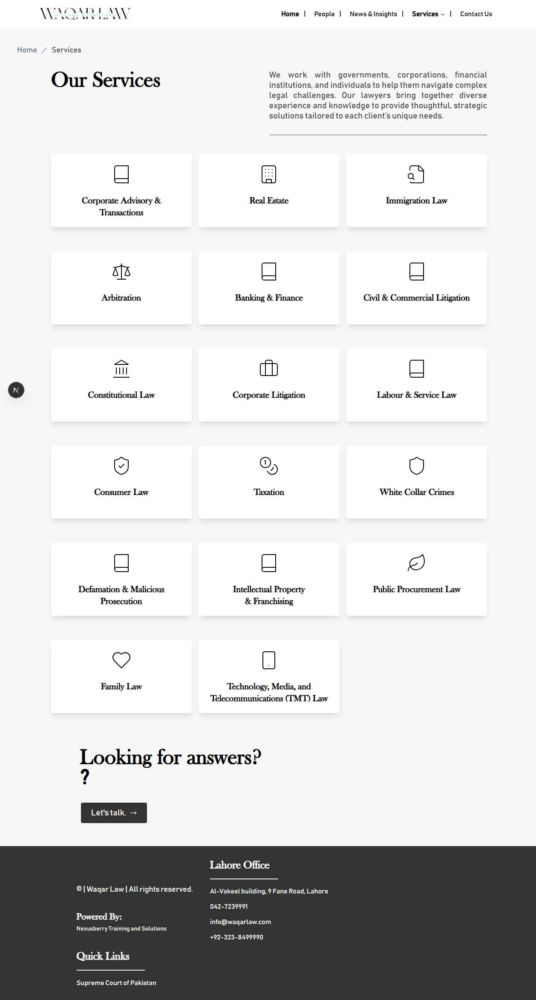

# WaqarLaw - Project Showcase

Welcome to the WaqarLaw project showcase! This repository highlights a comprehensive lawyer booking platform built with cutting-edge technologies. As a client project, this repo contains only screenshots and documentation for demonstration purposes, showcasing the skills and implementation details.

## Project Overview

WaqarLaw is a modern web application designed for booking lawyers based on specific cases. The platform features dynamic pages displaying lawyers and services, allowing users to book consultations easily. An integrated admin panel powered by PayloadCMS enables real-time management of user queries, blogs, and content. With ultra-fast performance from Next.js 15, editable pages like WordPress, and dynamic form creation, WaqarLaw offers a flexible and powerful solution.

## Key Features

- **Lawyer and Service Listings**: Browse and filter lawyers by case type and services offered.
- **Consultation Booking**: Easy-to-use booking system for scheduling consultations.
- **Admin Panel with PayloadCMS**: Real-time management of user queries, reviews, and approvals.
- **Blog Section**: Lawyers can write and publish blogs and articles.
- **Cloudinary Integration**: Secure cloud storage for all records and media.
- **Editable Pages**: WordPress-like editing capabilities for all pages.
- **Ultra-Fast Performance**: Powered by Next.js 15 for optimal speed.
- **Dynamic Forms**: Create and modify forms dynamically, adding or removing fields as needed.
- **Page and Redirect Management**: Easily create new pages and set up redirects.
- **Real-Time User Queries**: Manage and review user inquiries in real-time.

## Technology Stack

- **Frontend & Backend**: Next.js 15
- **CMS**: PayloadCMS
- **Database**: MongoDB
- **Storage**: Cloudinary
- **Deployment**: Ready for cloud hosting

## Screenshots

### Admin CMS Screenshots

These images showcase the admin panel interface for managing content, lawyers, media, and posts.

### Frontend Screenshots

These images demonstrate the user-facing website, including the homepage, team page, and services page.

---

*Showcasing the power of Next.js, PayloadCMS, MongoDB, and Cloudinary in building a robust lawyer booking platform.*
